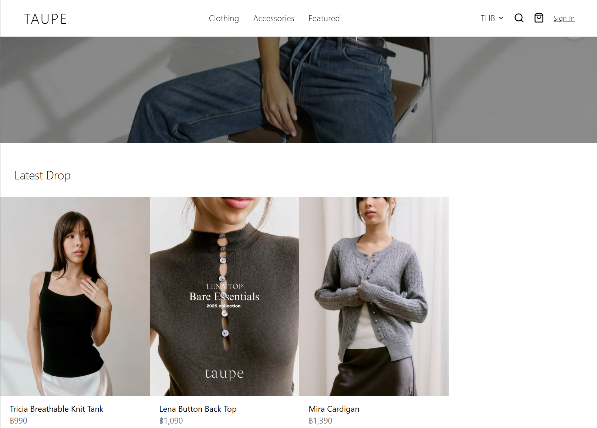

 

# Taupe Brand

Taupe Brand is a fully responsive e-commerce website I developed from scratch for a fashion brand looking to scale internationally. It features a clean UI, product filtering, a shopping cart, and Stripe-powered checkout.

> 💻 [Live Site](https://taupebrand.com) | 🧑‍💻 [GitHub Repo](https://github.com/Agneswei/taupe-brand)

---

## Features

- 🧭 Responsive navigation with categories
- 🛍️ Product listing and detail pages
- 🛒 Add to cart, remove, and checkout flow
- 💳 Stripe integration for secure payments
- 🌐 Built with a global user base in mind

---

## Tech Stack

- **Frontend:** React, TypeScript, Tailwind CSS
- **Backend:** Node.js, Express.js
- **Payments:** Stripe API

---

## Purpose

This project was part of a freelance engagement to help a fashion brand expand its digital presence. I focused on delivering a sleek, fast, and mobile-first experience aligned with industry leaders like Aritzia and Lululemon.

---

## What I Learned

- Integrating real-world e-commerce features
- Stripe API and secure payment flows
- Improving UX for mobile shoppers

---

## 🛠️ Getting Started

To run locally:

```bash
git clone https://github.com/Agneswei/taupe-brand.git
cd taupe-brand
npm install
npm start
